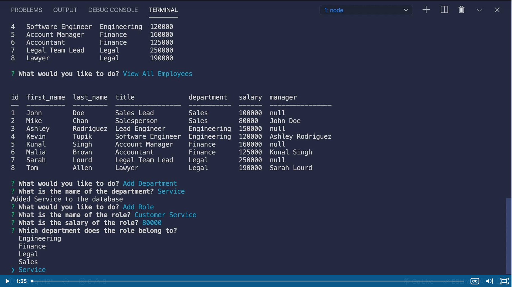

#  SQL: Employee Tracker Using CMD

## Requirments
You will need :

 -  Visual Studio Code or a similiar IDE
 - CLI
 - Node.js

## Getting Started
To get started clone the repo at https://github.com/Seropyan1995/Employee-Tracking-Challenge, incase you are not viewing from the repo itself. After cloning the repo use "npm i" to install the libraries within the package.json. This will install inquirer/mysl2/console.table/asciiart-logo. Afterwards in the root folder open the CLI and type node index.js and follow the prompts to guide you through your desired functions.

## Summary
An employee tracker that uses the command line to interract with the database to view tables and add values to the database.

## Mock-Up

## Changes to be made
For the purpose of showcasing the minimum skills taught within the weeks worth of course, this shows what was retained and learned. With that being said there are minor bugs that arent relevent that can be adjusted to make this a more fluid and bug free process.
## Contact
- https://github.com/Seropyan1995/Employee-Tracking-Challenge
